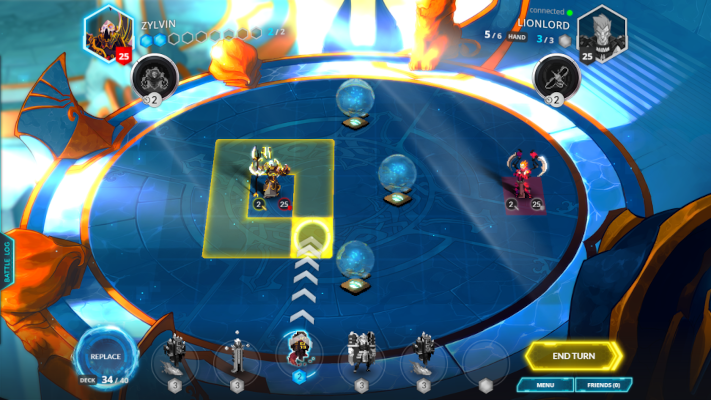
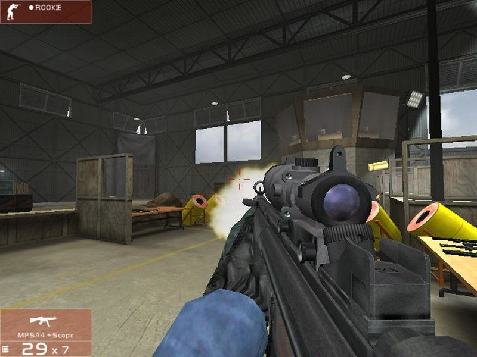
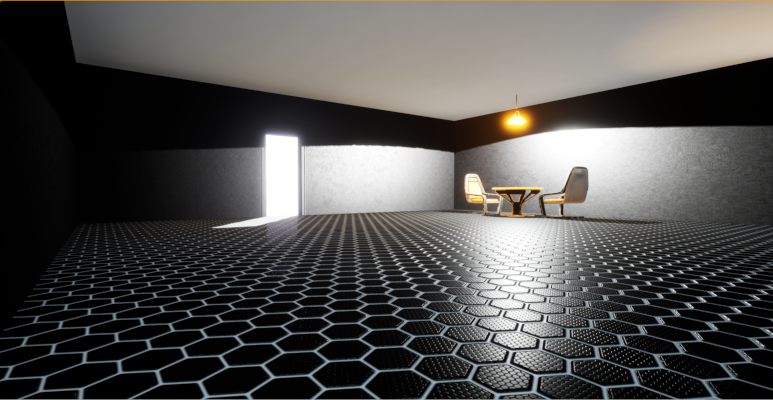
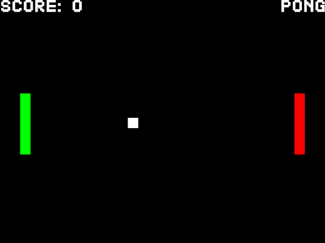
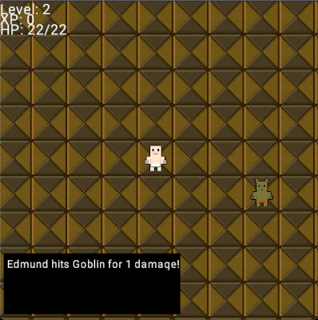

# Game Development Portfolio

Below is a list of games I have developed or contributed to. All of the following projects are available on Github.

# [In Development] Multiplayer FPS (Unreal Engine 5, 2023)

- C++
- Plugin
- Synchronization
- Anti-Cheat

Github URL: https://github.com/willroberts/ue5-multiplayer

# [In Development] Hack and Slash (Unreal Engine 4, 2023)

- Vertex School
- Blueprint
- Paragon Assets

Github URL: https://github.com/willroberts/ue4-hack-and-slash

# OpenDuelyst (Cocos2D Engine, 2022)

In 2022, I became the maintainer for the open-source release of _Duelyst_, a game developed by Counterplay Games in 2016. The game uses the [Cocos2d-html5](https://github.com/cocos2d/cocos2d-html5) engine, and is written in CoffeeScript and JavaScript. The desktop client is built and packaged with Electron.

Since joining the project, I have implemented support for mobile web clients, a feature to grant full card collections to new users, new gift crates for the in-game currency, automated boss scheduling, and adjustments to the game's economy and progression systems. I also contributed bug fixes, new libraries for handling database connections, dependency upgrades, improvements to developer tooling, AWS infrastructure automation, and documentation.

Github URL: https://github.com/open-duelyst/duelyst

# Minecraft RCON Clients (Game Tools, 2021)

I developed and published open-source RCON (remote server console) libraries written in Go, C#, Rust, TypeScript, Kotlin, and Scala for _Minecraft_, which uses Valve's [Source Engine RCON Protocol](https://developer.valvesoftware.com/wiki/Source_RCON_Protocol). These libraries enable players who are hosting _Minecraft_ servers to control them remotely, for administration or moderation purposes.

Each library is designed to follow the best practices for its language, particularly around unit testing, integration testing, linting, documentation, and packaging.

Github URLs: [Go](https://github.com/willroberts/minecraft-client), [C#](https://github.com/willroberts/minecraft-client-csharp), [Rust](https://github.com/willroberts/minecraft-client-rs), [TypeScript](https://github.com/willroberts/minecraft-client-ts), [Kotlin](https://github.com/willroberts/minecraft-client-kotlin), [Scala](https://github.com/willroberts/minecraft-client-scala)

# OpenRVS (Unreal Engine 2, 2020)

OpenRVS is a mod for _Tom Clancy's Rainbow Six 3: Raven Shield_, which was developed by Red Storm Entertainment and published by Ubisoft in 2003. The mod was originally developed by [Twi](https://github.com/rvstwi) in 2016, after Ubisoft closed the multiplayer servers for the original game. OpenRVS is implemented in UnrealScript, by overriding classes from the UnrealScript for the base game.

I joined the project in 2020, implementing UnrealScript classes for automated server registration (i.e. simply starting an OpenRVS server will make it appear for other players), asynchronous HTTP requests, version checking, performance timing, logging, and common string operations.

Github URL: https://github.com/OpenRVS-devs/OpenRVS

# Building Escape Game (Unreal Engine 4, 2017)

This is a simple first-person game where the player is tasked with finding the way out of a single room. The level makes use of starter content, light sources, and a trigger volume which powers a hidden pressure plate in the room.

All game logic is implemented in C++.

Github URL: https://github.com/willroberts/BuildingEscape

# Pong Clone (Custom SDL2 Engine, 2017)

This _Pong_ clone uses a custom game engine written in Go, which makes use of the SDL2 library for graphics, input handling, and fonts. The game includes basic artificial intelligence which will track the ball with a slight delay in reaction speed, enabling the player to win.

Github URL: https://github.com/willroberts/pong

# Untitled RPG (Engo Engine, 2016)

This is a tile-based roguelike game inspired by [_Castle of the Winds_](https://en.wikipedia.org/wiki/Castle_of_the_Winds). The game is written in Go, using the [Engo](https://engoengine.github.io/) game engine.

The character can move around the map one step at a time, using a turn-based system which advances after the player's action. Moving into an enemy starts combat, and defeating enemies grants experience and levels.

Art assets are from Jesse Freeman's [Tile Crusader](https://web.archive.org/web/20161122175612/http://jessefreeman.com/articles/free-game-art-tile-crusader), released under a public license.

Github URL: https://github.com/willroberts/rpg

