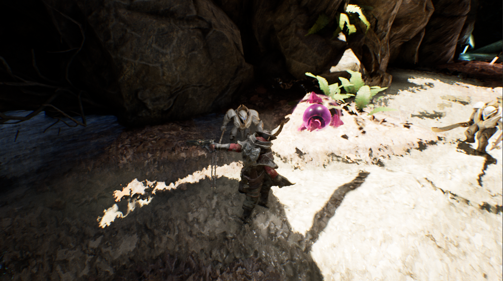
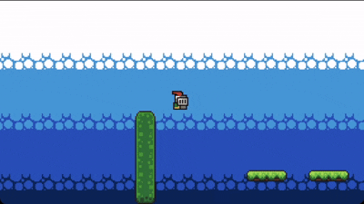
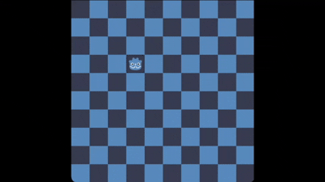

# Game Development Portfolio

Below is a list of games and game tools I have developed or contributed to. This list includes hobby and volunteer work. For my professional CV, see [LinkedIn](https://linkedin.com/in/willroberts11).

All of the following projects are available on Github.

Unreal Engine

## Multiplayer Third-Person Shooter (Unreal Engine 5, 2023)

A third-person, free-for-all shooter with peer-to-peer matchmaking. This project involved working with session-based matches, Steam integration, lag compensation via server-side rewind, selective replication, delegates, animation state machines, and a variety of weapons with hitscan-, projectile-, and area-based damage systems. Makes use of my multiplayer sessions plugin listed below.

Github URL: [https://github.com/willroberts/ue5-multiplayer-shooter](https://github.com/willroberts/ue5-multiplayer-shooter)

## Multiplayer Sessions Plugin (Unreal Engine 5, 2023)

This is an Unreal Engine plugin developed in C++ to leverage the [Online Subsystem](https://docs.unrealengine.com/5.1/en-US/online-subsystem-in-unreal-engine/), providing online multiplayer sessions via Steam, Epic Online Services, or a Local Area Network.

In addition to the core session management functionality, the plugin includes a Widget-based debug menu, a debug game mode which logs player actions, and a reusable `Logger` library for printing to the screen and writing to the log file.

Github URL: [https://github.com/willroberts/ue5-multiplayer-plugin](https://github.com/willroberts/ue5-multiplayer-plugin)

## Hack and Slash Game (Unreal Engine 4 & 5, 2023)

This is a game I created while taking classes at [The Vertex School](https://www.vertexschool.com/) with instructor Abraham Kim.

The player has melee and ranged attacks, a dash skill, a homing missile ultimate skill, and the ability to use emotes. The level contains several enemies which lead to a final boss encounter.

This necessitated working with many Unreal Engine systems, including dynamic collision with channels, hit detection with component overlap, materials and meshes, animation montages, blend spaces, animation notifies for particle effects and sounds, emitters, the projectile system, AI navigation meshes, AI target detection with pawn sensing, and more.

The game's logic is implemented in event-driven Blueprints, with performance-sensitive pieces such as Event Tick operations implemented in C++. I first developed the game with Unreal Engine 4, then reimplemented the game in Unreal Engine 5, making use of new features such as IK Rig retargeting, Lumen global illumination, and virtual shadow maps.

Art assets are from _Paragon_, Epic's canceled third-person MOBA game.

Github URLs: [Unreal Engine 4](https://github.com/willroberts/ue4-hack-and-slash), [Unreal Engine 5](https://github.com/willroberts/ue5-hack-and-slash)

Video walkthrough: [https://vimeo.com/804905608](https://vimeo.com/804905608)

## OpenRVS (Unreal Engine 2, 2020)

OpenRVS is a mod for _Tom Clancy's Rainbow Six 3: Raven Shield_, which was developed by Red Storm Entertainment and published by Ubisoft in 2003. The mod was originally developed by [Twi](https://github.com/rvstwi) in 2016, after Ubisoft closed the multiplayer servers for the original game. OpenRVS is implemented in UnrealScript, by overriding classes from the UnrealScript for the base game.

I joined the project in 2020, implementing UnrealScript classes for automated server registration (i.e. simply starting an OpenRVS server will make it appear for other players), asynchronous HTTP requests, version checking, performance timing, logging, and various utility helpers.

Github URL: [https://github.com/OpenRVS-devs/OpenRVS](https://github.com/OpenRVS-devs/OpenRVS)

## Building Escape Game (Unreal Engine 4, 2017)

This is a first-person game where the player is tasked with finding the way out of a single room. The level makes use of starter content, light sources, and a trigger volume which powers a hidden pressure plate in the room. All game logic is implemented in C++.

Github URL: [https://github.com/willroberts/BuildingEscape](https://github.com/willroberts/BuildingEscape)

Godot

## GDExtension Demo, C++ (Godot 4, 2025)

While Godot offers precompiled engines for GDScript and C# integration, it's also possible to make use of Godot's GDExtension API to integrate nearly any language with the engine. This project demonstrates native C++ integration of runtime classes (with the `GDREGISTER_RUNTIME_CLASS()` binding) and runtime+editor classes (with the `GDREGISTER_CLASS()` binding), both of which seamlessly integrate with GDScript once compiled.

This is useful since GDScript may not offer ideal performance in some scenarios, and the C# build of Godot may not offer the best compatibility (such as the lack of support for web exports in the build process).

Github URL: [https://github.com/willroberts/godot-cpp-gdextension](https://github.com/willroberts/godot-cpp-gdextension)

## 2D Platformer, GDScript (Godot 4, 2025)

A basic 2D platformer demonstrating common features of GDScript. Makes use of global state, signals, animations, audio streams, audio buses, cameras, tilemaps, collision, physics, raycasting, timescale, and timers.

Github URL: [https://github.com/willroberts/godot-platformer](https://github.com/willroberts/godot-platformer)

## Godot Grid Engine, C# (Godot 4, 2023)

This is a Godot library for games with grid-based movement, such as Tactical RPGs. Provides realtime computation of the shortest path between two grid cells using the A* pathfinding algorithm, as well as native C# classes for representing grids, multi-layer boards, and layers which can contain actors implementing the `IOccupant` interface.

Github URL: [https://github.com/willroberts/godot-grid-engine](https://github.com/willroberts/godot-grid-engine)

Other Engines

## OpenDuelyst (Cocos2D Engine, 2022)

In 2022, I became the maintainer for the open-source release of _Duelyst_, a game developed by Counterplay Games in 2016. The game uses the [Cocos2d-html5](https://github.com/cocos2d/cocos2d-html5) engine, and is written in CoffeeScript and JavaScript. The desktop client is built and packaged with Electron.

Since joining the project, I have implemented support for mobile web clients, a feature to grant full card collections to new users, new gift crates for the in-game currency, automated boss scheduling, and adjustments to the game's economy and progression systems. I also contributed bug fixes, new libraries for handling database connections, dependency upgrades, improvements to developer tooling, AWS infrastructure automation, and documentation.

Github URL: [https://github.com/open-duelyst/duelyst](https://github.com/open-duelyst/duelyst)

## Minecraft RCON Clients (Various, 2021)

I developed and published open-source RCON (remote server console) libraries written in Go, C#, Rust, TypeScript, Kotlin, and Scala for _Minecraft_, which uses Valve's [Source Engine RCON Protocol](https://developer.valvesoftware.com/wiki/Source_RCON_Protocol). These libraries enable players who are hosting _Minecraft_ servers to control them remotely, for administration or moderation purposes.

Each library is designed to follow the best practices for its language, particularly around unit testing, integration testing, linting, documentation, and packaging.

Github URLs: [Go](https://github.com/willroberts/minecraft-client), [C#](https://github.com/willroberts/minecraft-client-csharp), [Rust](https://github.com/willroberts/minecraft-client-rs), [TypeScript](https://github.com/willroberts/minecraft-client-ts), [Kotlin](https://github.com/willroberts/minecraft-client-kotlin), [Scala](https://github.com/willroberts/minecraft-client-scala)

## Pong Clone (Custom SDL2 Engine, 2017)

This _Pong_ clone uses a custom game engine written in Go, which makes use of the SDL2 library for graphics, input handling, and fonts. The game includes basic artificial intelligence which will track the ball with a slight delay in reaction speed, enabling the player to win.

Github URL: [https://github.com/willroberts/pong](https://github.com/willroberts/pong)

## Untitled RPG (Engo Engine, 2016)

This is a tile-based roguelike game inspired by [_Castle of the Winds_](https://en.wikipedia.org/wiki/Castle_of_the_Winds). The game is written in Go, using the [Engo](https://engoengine.github.io/) game engine. The character can move around the map one step at a time, using a turn-based system which advances after the player's action. Moving into an enemy starts combat, and defeating enemies grants experience and levels.

Art assets are from Jesse Freeman's [Tile Crusader](https://web.archive.org/web/20161122175612/http://jessefreeman.com/articles/free-game-art-tile-crusader), released under a public license.

Github URL: [https://github.com/willroberts/rpg](https://github.com/willroberts/rpg)

