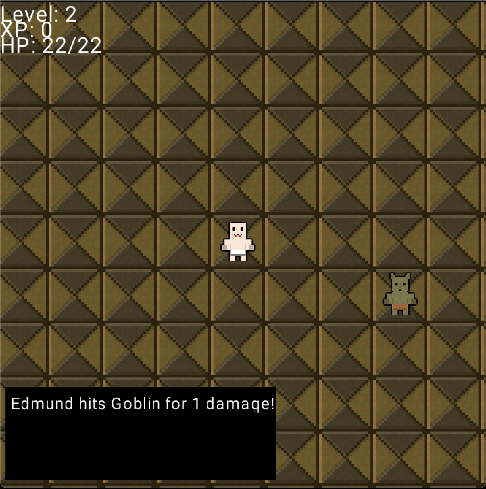

# Game Development Portfolio

## UE5 Multiplayer FPS (2023)

## UE4 Hack and Slash (2023)

## OpenDuelyst (2022)

I'm a maintainer for [_OpenDuelyst_], a game developed by Counterplay Games in 2016 and later open-sourced. The game uses the Cocos2d-HTML5 engine, and is written in CoffeeScript and JavaScript.

## UE4 Escape Game

## OpenRVS

## Pong Clone (2017)

This game uses a custom game engine written in Go, which makes use of the SDL2 library for graphics, input handling, and fonts.

## Untitled RPG (2016)

This is a tile-based roguelike game inspired by [_Castle of the Winds_]. The game is written in Go, using the Engo game engine.

The character can move around the map one step at a time, using a turn-based system which advances after the player's action. Moving into an enemy starts combat, and defeating enemies grants experience and levels.

